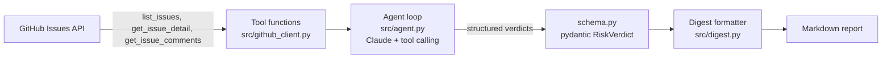

# Sprint Risk Agent

An agent that scans a GitHub repo's open issues and flags the ones quietly going sideways — stale, blocked, unowned, or high-priority-but-forgotten — and writes the status digest a human would actually send.

Built to demonstrate real agentic tool-use (not a chatbot wrapper), structured output, and an evaluation harness that measures the agent against both a hand-labeled test set and a naive rule-based baseline.

## The problem

Every TPM or eng lead spends hours a week scanning a backlog for issues that are silently rotting: no update in two weeks, no assignee, marked "blocked" with no comment explaining why. This automates that first pass.

## Sample output

```
# Sprint Risk Digest — octocat/example-repo
_Generated 2026-09-08 20:32 UTC_

**6 issue(s) flagged.**

## Blocked (2)

- **#102 — Webhook retries not honoring backoff config** _(confidence: high)_
  Labeled blocked, still waiting on platform team per latest comment.
  → Ping platform team for ETA or escalate.
- **#110 — Rate limiter config drifted from prod values in staging** _(confidence: medium)_
  Labeled blocked, idle 15 days with zero comments.
  → Check if the blocker is still valid.

## High priority, going quiet (1)

- **#104 — Payment retry logic double-charges on network timeout** _(confidence: high)_
  Priority: high label, 22 days idle despite a 'prioritizing soon' comment.
  → Confirm this is actually on the current sprint.

## Stale (1)

- **#101 — Export button silently fails on large datasets** _(confidence: medium)_
  No update in 38 days despite an early 'taking a look' comment.
  → Ask for a status update.

## Unowned (2)

- **#103 — Dark mode toggle resets on page refresh** _(confidence: high)_
  No assignee, 4 days since last activity.
  → Assign an owner.
- **#107 — Migrate legacy auth tokens to new format** _(confidence: medium)_
  Assignee is out for 3 weeks per their own comment; effectively unowned.
  → Reassign while frank is out.
```

## Architecture



The agent doesn't get fed a wall of text — it calls tools to pull real data (labels, assignee, timestamps, comment threads) and decides what to look at next. Output is validated against a typed schema, not trusted as raw text.

## Why the eval harness matters

Most "AI agent" side projects skip measurement entirely. This one scores two classifiers against the same 8 hand-labeled issues in `eval/labeled_issues.json`:

| Approach | Accuracy | Notes |
|---|---|---|
| Rule-based baseline (`eval/baseline.py`) | 6/8 (75%) | Fast, free, no LLM — but only looks at labels/assignee/dates |
| Claude agent (`src/agent.py`) | _run it and fill this in_ | Reads comment threads, should catch what the baseline misses |

The eval set includes two deliberate "trap" cases: an issue still labeled `blocked` whose comments show it was actually resolved, and an issue with an assignee who commented they're out for three weeks. The baseline gets both wrong because it never reads comments — that gap is exactly what the tool-calling agent is meant to close.

Run the baseline report yourself:
```bash
python -m eval.score
```

## Project structure

```
sprint-risk-agent/
├── src/
│   ├── github_client.py   # tool functions: list_issues, get_issue_detail, get_issue_comments
│   ├── agent.py            # Claude tool-calling loop
│   ├── schema.py            # pydantic RiskVerdict model
│   └── digest.py             # formats verdicts into a markdown report
├── eval/
│   ├── labeled_issues.json   # 8 hand-labeled sample issues
│   ├── baseline.py            # naive rule-based classifier
│   └── score.py                # scores predictions against the labeled set
├── tests/                        # pytest, all mocked — no API keys needed to run
└── .github/workflows/ci.yml         # runs tests + baseline report on every push
```

## Running it

```bash
git clone https://github.com/DaleShockley/sprint-risk-agent.git
cd sprint-risk-agent
pip install -r requirements.txt

# unit tests (no keys needed)
pytest tests/ -v

# baseline eval report (no keys needed)
python -m eval.score

# run the live agent against a real repo (needs ANTHROPIC_API_KEY)
export ANTHROPIC_API_KEY=sk-...
python -m src.agent octocat/hello-world
```

## What's next

- Wire the live agent's output into `eval/score.py` for a real agent-vs-baseline comparison
- Slack webhook output as an alternative to the markdown digest
- Scheduled runs via GitHub Actions so it posts a digest automatically
- A zero-shot (no tools) baseline, to make the case for tool-calling explicit alongside the rule-based one
